# qrag — Architecture & Design Decisions

This file documents the key architectural decisions in qrag with Mermaid diagrams.
Update it whenever a design decision is made or changed. Use Mermaid syntax for all diagrams.

---

## System Overview

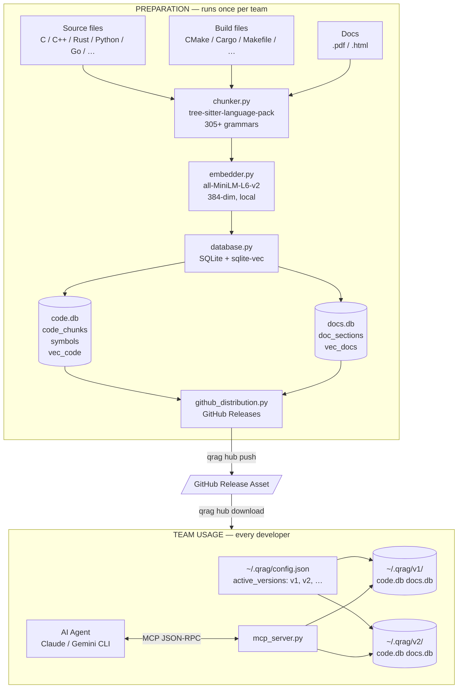

---

## AD-1: Multi-DB Fan-Out Search (IS3)

**Decision:** Users can activate multiple independently-prepared databases at once.
All four MCP tools fan-out across every active DB in parallel, merge results by
score, and deduplicate before returning to the AI agent.

**Why:** Teams work with multiple SDKs, RTOSes, and doc sets simultaneously.
Requiring a merged re-build for each new source is prohibitive. Pre-built DBs
downloaded independently must be queryable together without rebuilding.

### Config Migration

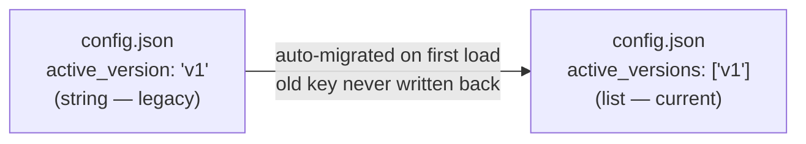

### Fan-Out Flow

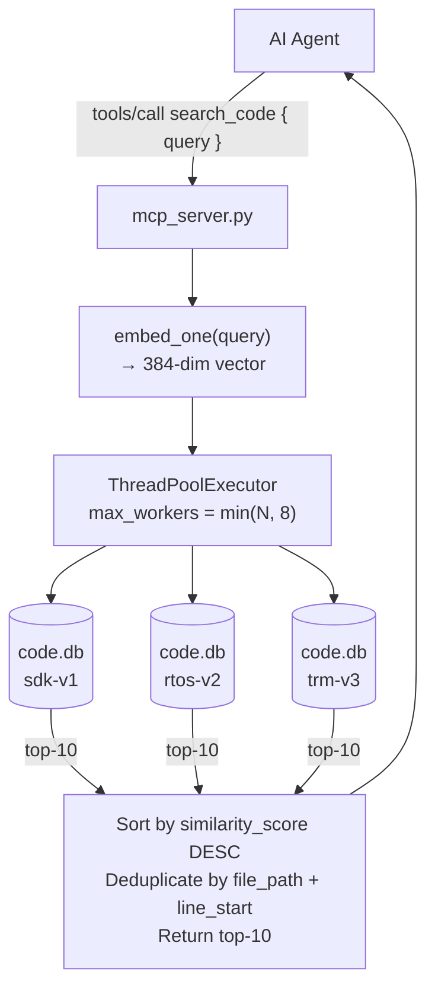

### Per-DB Search (inside database.py)

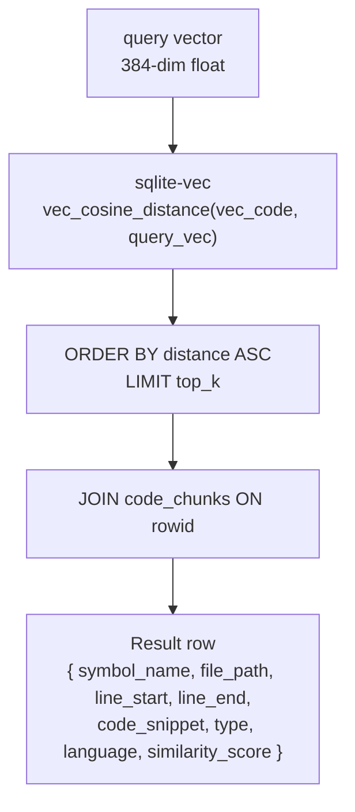

### Complexity

| Scenario | Wall-clock cost |
|----------|----------------|
| 1 DB | 1× single-DB search latency |
| N DBs (N ≤ 8) | ≈ 1× single-DB search latency (fully parallel) |
| N DBs (N > 8) | ≈ ⌈N/8⌉ × single-DB search latency |

sqlite-vec cosine search is **O(rows)** per DB. At ~4 MB per DB (~10k chunks),
a single search completes in <50 ms on CPU. 100 DBs with 8 workers = ~13 rounds
≈ 650 ms worst case — acceptable for an AI-agent tool call.

### CLI Usage

```
# Set one active version
qrag ai active sdk-v1

# Set multiple active versions (replaces the list)
qrag ai active sdk-v1 rtos-v2 trm-v3

# Show current active versions
qrag ai active

# build and hub download auto-add to the list
qrag build -i /path/to/code -o sdk-v1      # → active_versions gains "sdk-v1"
qrag hub download rtos-v2                    # → active_versions gains "rtos-v2"
```

---

## AD-2: Dependency Split — Consumer vs Builder (GH#13)

**Decision:** Builder dependencies (parsing, grammar, doc parsing) are optional
extras. The consumer install only needs `click + sqlite-vec + sentence-transformers`.

**Why:** `sentence-transformers` pulls in `torch` and GPU deps. `tree-sitter-language-pack`
is large. Teams that only download and query pre-built DBs shouldn't pay that cost.

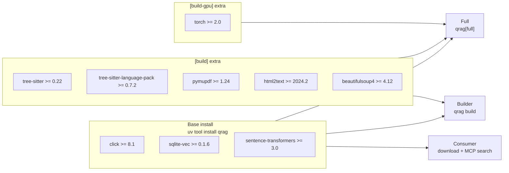

**Guard in `build()`:** `_ensure_build_deps()` probes `tree_sitter`, `fitz`,
`tree_sitter_language_pack` → prints reinstall instructions and exits 1 if missing.

---

## AD-3: Embedding Model — Bundled Local (all-MiniLM-L6-v2)

**Decision:** `all-MiniLM-L6-v2` (384-dim) is bundled inside the wheel under
`src/qrag/models/`. No HuggingFace call at runtime.

**Why:** Air-gapped embedded-systems environments cannot reach HuggingFace.
Startup time must be deterministic. The model is small (≈22 MB).

**Trade-off:** Wheel is larger. Model version is pinned and must be explicitly
updated. A future model upgrade requires a new wheel release.

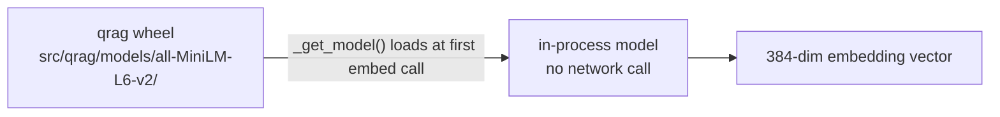

---

## AD-4: SQLite + sqlite-vec (no external vector DB)

**Decision:** All storage is a single SQLite file with sqlite-vec for vector
search. No Chroma, Pinecone, or other external service.

**Why:** Pre-built DBs are distributed as GitHub Release assets and downloaded
by the team. A single-file format requires zero server infra, works offline,
and is trivially versioned via GitHub Releases.

**Trade-off:** sqlite-vec cosine search is O(n) — no ANN index. At current
scale (~10k chunks per DB) this is fast enough. If a single DB exceeds ~1M
chunks, an ANN index (e.g. FAISS) would be needed.

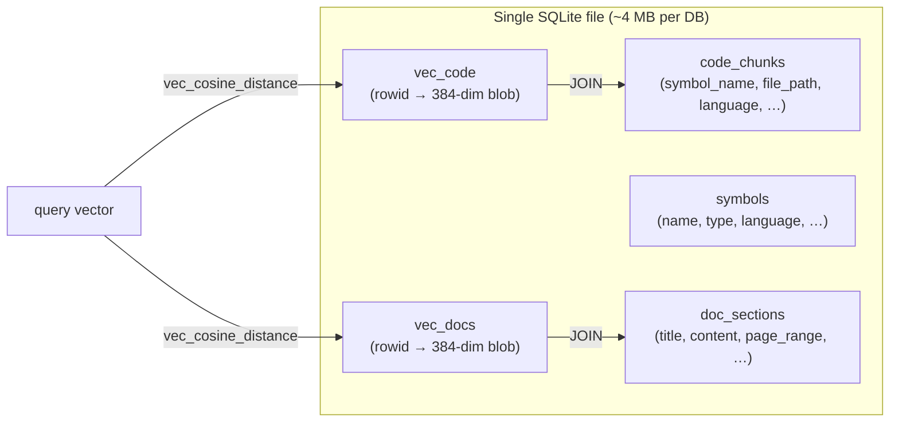

---

## AD-5: Multi-Language Parsing — Registry-Driven (C0)

**Decision:** `chunker.py` uses `tree-sitter-language-pack` (305+ grammars)
with a registry-driven rule engine. `chunk_type` is a free-form string, not an enum.

**Why:** Individual `tree-sitter-c/cpp` packages don't scale to 30+ languages.
Free-form `chunk_type` means new language support never requires a DB schema
migration — just a new registry entry.

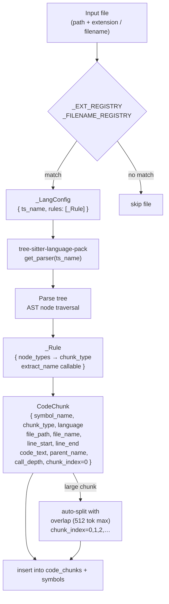

---

## AD-6: Rich Code Metadata — IS5

**Decision:** `code_chunks` gains four new columns: `file_name` (basename), `parent_name`
(enclosing block), `call_depth` (nesting level), `chunk_index` (sub-chunk index within
a split symbol). Existing DBs are auto-migrated via `ALTER TABLE` on open.

**Why:** The AI agent needs precise citation (file + line range), structural context
(what class/namespace owns this function), and sub-chunk tracking (which slice of a
large function it is looking at) to answer questions accurately.

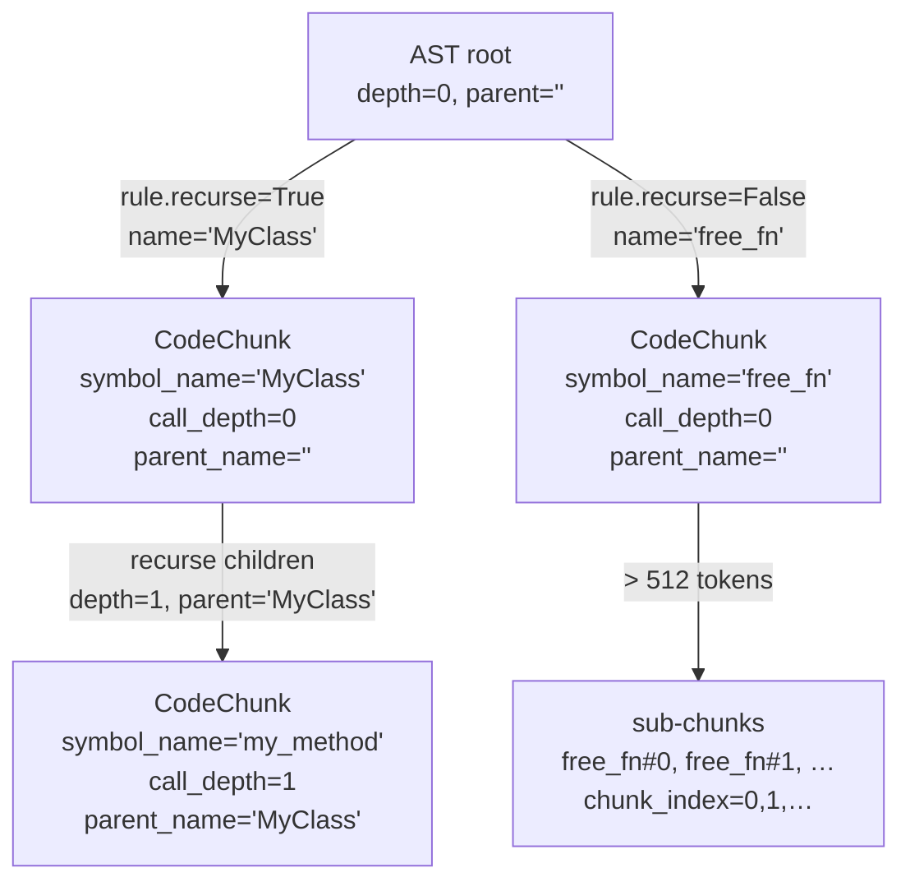

**Schema migration:** `_open_code()` runs `ALTER TABLE code_chunks ADD COLUMN …` for
each new column on every open; `sqlite3.OperationalError` is swallowed when the column
already exists. `init_code_db` includes all columns in `CREATE TABLE IF NOT EXISTS`.

---

## AD-7: Rich Doc Metadata — IS4

**Decision:** `doc_sections` gains five new columns: `doc_name`, `doc_revision`,
`doc_status`, `word_count`, `fig_table_refs`. Extracted at parse time from the filename
and section content. Existing DBs are auto-migrated on open via `_open_docs()`.

**Why:** LLMs need to cite documents precisely (which document, which revision, which
status). Figure/table references let the agent locate companion material. Word count
helps the agent judge whether content has been truncated.

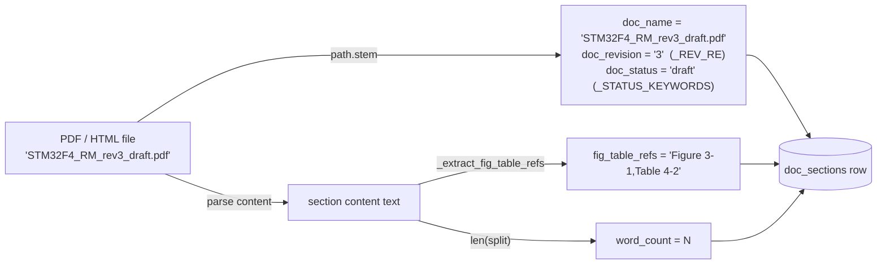

**Revision extraction:** `_REV_RE = r'[_\\-\\s](?:rev?|ver?|version)\\.?\\s*(\\d+[.\\d]*)'`
matches `_rev3`, `_v2`, `_Rev1.2` etc. from the filename stem.

**Status extraction:** first match of `released | approved | final | review | draft | obsolete`
in the lowercased filename stem. Empty string if none matched.

---

## AD-8: Rich TUI Progress + Build Report (IS1, IS2)

**Decision:** `qrag build` displays three transient Rich progress bars
(Overall / Parse / Embed) that collapse on completion, leaving a single
uv-style summary line. A plain-text `build-report.txt` is always written
to `~/.qrag/<version>/` with per-file stats, language breakdown, and
skipped-file inventory.

**Why (IS1):** Plain `click.echo` output gave no feedback during long
builds — the tool appeared frozen on large codebases. The uv/indicatif
pattern (transient bars → single summary line) is familiar to the target
audience.

**Why (IS2):** Zero visibility into what entered the database. Users
couldn't verify which files were parsed, which languages were detected,
or which files were silently dropped due to parse errors or zero chunks.

**Trade-off:** `rich>=13.0` is added only to the `[build]` optional-
dependencies, keeping the consumer install lean. Rich is disabled when
`--verbose` is active (JSON logs and Rich escape codes conflict on the
same stderr fd).

### Build Pipeline with Progress Instrumentation

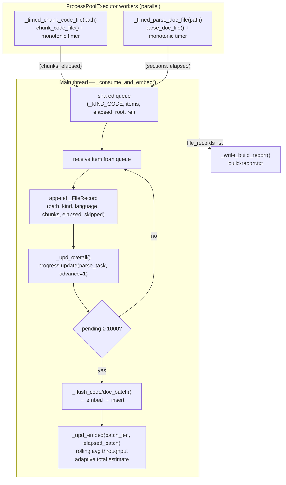

### Three-Bar Layout (transient=True, collapses on completion)

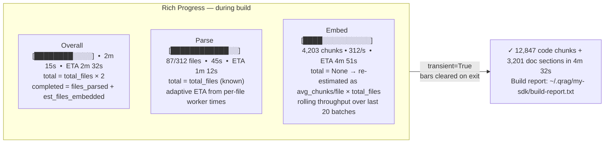

### Adaptive ETA Model

| Bar | Known upfront | Adaptive signal | ETA formula |
|-----|--------------|-----------------|-------------|
| Parse | `total_files` | per-file elapsed from worker | Rich built-in (speed = completed / elapsed) |
| Embed | `None` → updated | avg chunks/file from completed files | `(est_total - chunks_embedded) / rolling_throughput` |
| Overall | `total_files × 2` | parse fraction + embed fraction | combined advancement of both bars |

### Build Report Structure (`build-report.txt`)

```
qrag build report
Generated : 2026-06-26 14:32:01
Output    : my-sdk

======================================================================
SUMMARY
======================================================================
Total wall-clock time  : 4m 32s
Code files processed   : 287 (2 skipped)
Doc files processed    : 23 (1 skipped)
Code chunks stored     : 12,847
Doc sections stored    : 3,201
code.db size           : 48.2 MB
docs.db size           : 12.7 MB

======================================================================
BY LANGUAGE
======================================================================
Language              Files   Chunks   Avg/file       Time
...

======================================================================
SKIPPED FILES
======================================================================
Reason          Path
zero_chunks     src/empty.h
parse_error     docs/corrupted.pdf
```

---

## AD-9: Rich TUI MVC Architecture — GH#26

**Decision:** All Rich rendering logic is extracted into `src/qrag/tui.py`. `cli.py`
owns data processing only; it fires event callbacks (`on_file_parsed`, `on_error`,
`on_embed_batch`) into a `BuildLayout` instance that manages the full terminal layout.

**Why:** AD-8's TUI lived entirely in `cli.py` as nested closures and inline Rich
imports. Adding a scrolling log panel, a status line, a worker header, and fallback
logic would have made `cli.py` unreadable. MVC separation keeps rendering isolated,
independently testable, and easy to extend.

**Trade-off:** One extra module (`tui.py`). Rich imports are still lazy (`[build]`
extras only); `tui.py` is only imported inside `build()` after `_ensure_build_deps()`
confirms Rich is present.

### Layout Hierarchy (during `qrag build`)

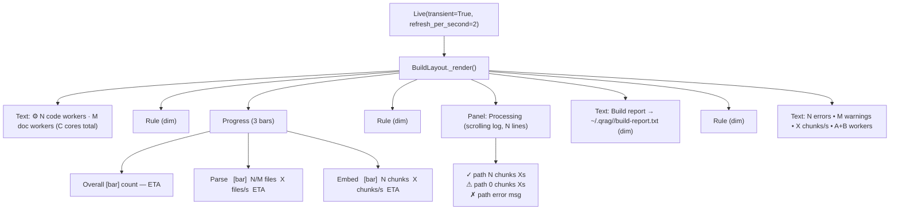

### Fallback Mode (terminal too small)

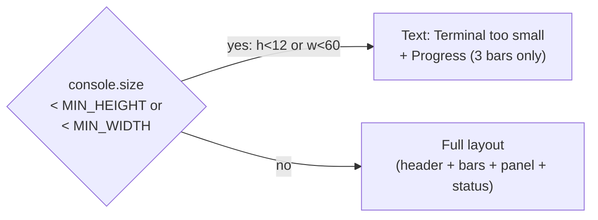

### Proportional CPU Split (GH#27, applied here)

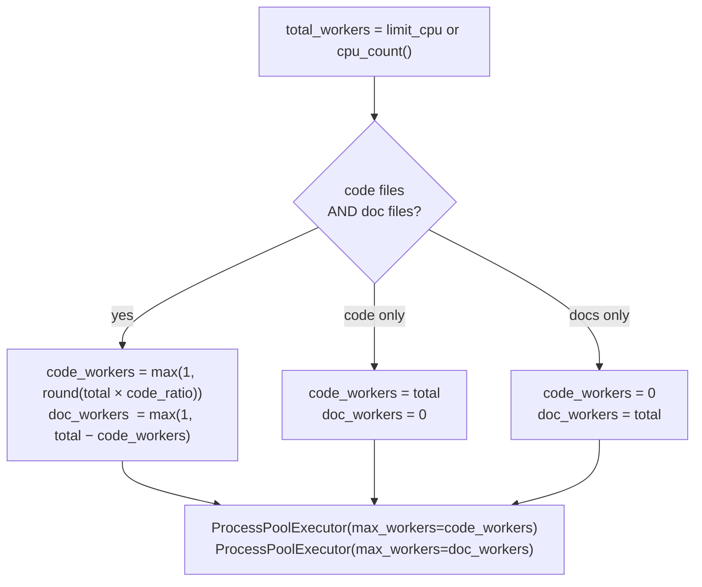

### Real-Time Error Queue

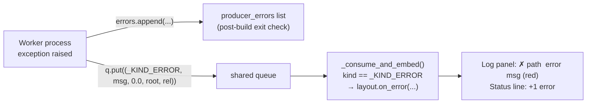

### Custom Progress Columns (fixed-width grid)

| Column | Class | Min width | Content |
|--------|-------|-----------|---------|
| Count | `_FieldColumn("count")` | 15 | `"N/M files"` / `"N chunks"` / `""` |
| Rate | `_FieldColumn("rate")` | 16 | `"X files/s"` / `"X chunks/s"` / `"—"` |
| ETA | `_EtaColumn` | 8 | `fmt_eta(task.time_remaining)` |

`fmt_eta(seconds)` → `"Xs"` (< 60) / `"Xm Ys"` (< 3600) / `"Xh Ym"` (≥ 3600)

### Path Truncation (`fmt_path`)

```
Full path fits      → a/b/c/file.c
start/…/parent/file → sdk/…/gpio/gpio.c   ← preferred, grow head
…/parent/file       → …/gpio/gpio.c
…/file              → …/gpio.c
filename only       → gpio.c (truncated if still too long)
```

---

## AD-10: qrag explore — Unified Database Explorer (replaces hub)

**Decision:** `qrag hub` is replaced entirely by `qrag explore`. `explore` exposes the same operations (list, download, push, delete) as discrete subcommands for scripting/CI, and additionally opens a full-screen Rich TUI when invoked with no arguments. Multiple remote backends are supported via a registry in `~/.qrag/config.json`.

**Why:** `hub` was a thin wrapper around a single GitHub Releases remote. Teams now need to: (1) see local and remote databases in one unified view; (2) visualize database contents (language stats, keyword tags, staleness); (3) push to multiple destinations (GitHub, HuggingFace Hub, JFrog Artifactory, git+LFS); (4) safely delete with auto-deactivation. None of these fit cleanly into the existing `hub` surface.

**Trade-off:** `hub` is deprecated (hidden alias for one release cycle) before removal. New backend modules (HF Hub, JFrog, git+LFS) add optional runtime deps only when those remotes are configured.

### qrag explore Command Tree

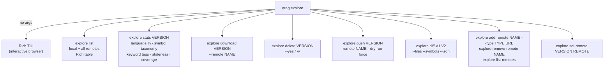

### Multi-Remote Architecture

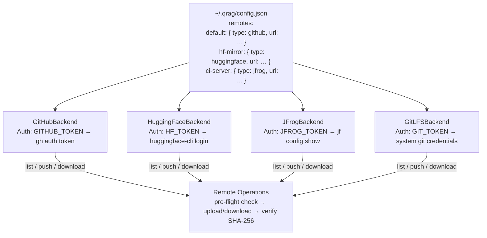

### Origin Tracking

Every downloaded database records its source remote in `~/.qrag/<version>/config.json`:

```json
{ "origin_remote": "default", "origin_version": "v1.0" }
```

`explore push` defaults to `origin_remote`; `explore set-remote` reassigns it anytime.

### Keyword Tag Cloud — Two Sources

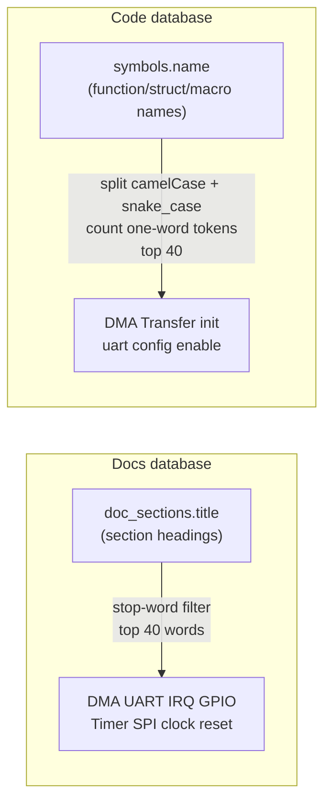

### Implementation Plan (issue dependency chain)

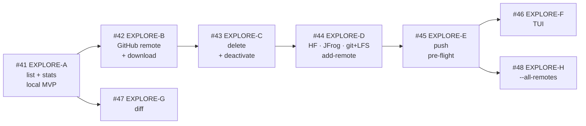

Each step is independently end-to-end testable. Epic tracked in GH#49.

---

## AD-11: CPU-Only Torch Default (GH#35)

**Decision:** `[tool.uv.sources]` in `pyproject.toml` redirects `torch` to the official PyTorch CPU-only wheel index (`https://download.pytorch.org/whl/cpu`) for all uv installs. The CUDA wheel is only fetched when the user explicitly passes `--no-sources` (uv) or installs `[full]` via pip.

**Why:** `sentence-transformers` (a base dependency) pulls in `torch`, and the default PyPI `torch` wheel on Linux bundles 15 NVIDIA/CUDA libraries totalling ~2.3 GB — all unused on CPU-only machines. The CPU wheel reduces the default install from **~2.53 GB to ~220 MB** (~91% reduction).

**Trade-off:** `[tool.uv.sources]` is uv-specific; pip and pipx users still get the CUDA wheel unless they pre-install `torch --index-url .../cpu` first. The permanent fix (GH#38) is to replace `torch` entirely with `onnxruntime` (~10 MB).

```mermaid
flowchart TD
    INST["uv tool install qrag"]
    INST --> SRC{"[tool.uv.sources]\ntorch source?"}
    SRC -->|"default (no --no-sources)"| CPU["pytorch-cpu index\nhttps://download.pytorch.org/whl/cpu\ntorch CPU wheel  ~220 MB"]
    SRC -->|"--no-sources flag"| CUDA["default PyPI\ntorch CUDA wheel + 15 NVIDIA pkgs\n~2.53 GB"]

    subgraph FUTURE["GH#38 — future"]
        ORT["onnxruntime  ~10 MB\nno torch dependency\nworks for pip + pipx + uv"]
    end
```

## AD-12: Replace sentence-transformers+torch with onnxruntime (GH#38)

**Decision:** Replace `sentence-transformers` and `torch` with `onnxruntime` + `tokenizers` for embedding inference. The ONNX-format `all-MiniLM-L6-v2` model (`Xenova/all-MiniLM-L6-v2` on HuggingFace) is bundled in the wheel and cached at `~/.qrag/models/all-MiniLM-L6-v2/` on first use when not bundled.

**Why:** `torch` is the sole reason for the 2.53 GB install size. `onnxruntime` provides the same CPU inference at ~30 MB total (onnxruntime ~10 MB + ONNX model ~22 MB). This fix benefits all package managers (pip, pipx, uv) equally — unlike AD-11 which was uv-only. Removes AD-11 `[tool.uv.sources]` entirely.

**Trade-off:** CUDA acceleration is no longer automatic; users needing GPU must install `onnxruntime-gpu` separately. Embeddings produced by onnxruntime may differ from sentence-transformers by floating-point rounding — teams rebuilding DBs should re-run `qrag build` to ensure vector consistency.

```mermaid
flowchart TD
    INST["uv/pip/pipx install qrag"]
    INST --> PKG["onnxruntime ~10 MB\ntokenizers ~3 MB\nhuggingface_hub ~5 MB\nTotal: ~30 MB"]
    PKG --> LOAD["embedder.py\n_load()"]
    LOAD --> LOCATE{"Bundled model?\n_BUNDLED_MODEL or\n_RUNTIME_MODEL"}
    LOCATE -->|found| SESS["onnxruntime.InferenceSession\nCPUExecutionProvider"]
    LOCATE -->|not found| DL["hf_hub_download\nXenova/all-MiniLM-L6-v2\n  tokenizer.json\n  onnx/model.onnx"]
    DL --> SESS
    SESS --> TOK["tokenizers.Tokenizer\nencode_batch → input_ids\n  attention_mask\n  token_type_ids"]
    TOK --> INF["ONNX inference\nlast_hidden_state [B, 128, 384]"]
    INF --> POOL["mean_pool + L2 normalize"]
    POOL --> EMB["float32 embeddings [B, 384]"]
```

---

## AD-13: ZIP-Based Database Export / Import (EXPLORE-ZIP)

**Decision:** `qrag explore export <version>` and `qrag explore import <file.zip>` provide offline peer-to-peer database sharing via a self-contained ZIP, ahead of the GitHub/JFrog remote backends (GH#42–45). All logic lives in `zip_distribution.py`; no new runtime dependencies (stdlib `zipfile`, `hashlib`, `shutil`).

**Why:** Teams need to transfer pre-built databases to air-gapped machines or share with colleagues who don't have GitHub access. ZIP is universally readable, doesn't require auth, and is trivially emailed or copied over SCP/USB.

**Trade-off:** No deduplication or delta transfer — the full ZIP is written even if only `docs.db` changed. Acceptable at MVP; future `explore push` to a proper remote will supersede this for large databases.

```mermaid
flowchart TD
    EXP["qrag explore export VERSION"]
    EXP --> VDIR["CACHE_DIR/VERSION/\ncode.db · docs.db\nconfig.json · build-report.txt"]
    VDIR --> SHA["_sha256() per file\nhashlib.sha256 / 65 KB chunks"]
    SHA --> MAN["manifest.json\n{ version, exported_at,\n  embedding_model, files: {sha256, size} }"]
    MAN --> ZIP["version.zip\nZIP_DEFLATED\nversion/ prefix on every entry"]

    IMP["qrag explore import FILE.zip"]
    IMP --> RMAN["read manifest.json\nfrom ZIP"]
    RMAN --> CONF["conflict check\nCAHCE_DIR/target exists?\n--yes or [y/N]"]
    CONF --> EXT["extract files\nstrip top-level prefix\n→ CACHE_DIR/target/"]
    EXT --> VER["verify SHA-256\nevery file in manifest.files"]
    VER -->|pass| REG["add_active_version(target)"]
    VER -->|fail| CLN["shutil.rmtree(target_dir)\nClickException"]
```

---

## AD-14: Real GPU Embedding via onnxruntime-gpu (ISSUE-008)

**Decision:** `resolve_device()` now performs real CUDA detection through `onnxruntime.get_available_providers()` instead of unconditionally returning `"cpu"`. `onnxruntime` is split out of the base dependencies into two mutually-exclusive extras — `[cpu]` (`onnxruntime`) and `[gpu]` (`onnxruntime-gpu`) — both pinned to `>=1.19,<2.0` (the version floor that requires CUDA 12.x + cuDNN 9). `[full]` becomes an alias for `[build, gpu]`.

**Why:** AD-12 replaced `torch`+`sentence-transformers` with `onnxruntime` for install-size reasons, but as a side effect `resolve_device("cuda")` was left raising a `ValueError` and `auto` always resolved to `"cpu"` — GPU embedding was advertised (`--device` flag, README `[full]` extra) but never actually reachable. Additionally, `onnxruntime` and `onnxruntime-gpu` both occupy the same import namespace and cannot coexist, so `onnxruntime-gpu` could not be safely added as a plain extra on top of the base dependency — it had to replace it. Splitting into `[cpu]`/`[gpu]` extras is the only way `pip`/`uv` can produce a reproducible environment for either path.

**Trade-off:** Every install command (including plain Consumer installs) must now explicitly pick `[cpu]` or `[gpu]` — `qrag` alone is no longer installable, since a bare install would resolve zero embedding backends. This is a one-time breaking change to install instructions, documented in the README's Consumer and Builder sections. GPU users also take on system-level CUDA/cuDNN maintenance burden that the CPU path avoids entirely; the README documents Linux/Windows/WSL prerequisites explicitly (including the WSL-specific gotcha that the NVIDIA driver must live on the Windows host, not inside the WSL distro).

```mermaid
flowchart TD
    BUILD["qrag build --device=auto|cpu|cuda"]
    BUILD --> RESOLVE["resolve_device(requested)"]
    RESOLVE -->|"auto"| CHECK{"onnxruntime.get_available_providers()\ncontains CUDAExecutionProvider?"}
    CHECK -->|yes| CUDA["device = cuda\nbatch_size = 1024"]
    CHECK -->|no| CPU["device = cpu\nbatch_size = 256"]
    RESOLVE -->|"cuda (explicit)"| CHECK2{"CUDAExecutionProvider\navailable?"}
    CHECK2 -->|yes| CUDA
    CHECK2 -->|no| ERR["ValueError:\ninstall onnxruntime-gpu (qrag[gpu])\n+ CUDA 12.x + cuDNN 9"]
    RESOLVE -->|"cpu (explicit)"| CPU

    CUDA --> LOAD["_load(device)\nInferenceSession providers=\n[CUDAExecutionProvider, CPUExecutionProvider]"]
    CPU --> LOAD2["_load(device)\nInferenceSession providers=\n[CPUExecutionProvider]"]

    subgraph PKG["pyproject.toml extras"]
        CPUEXT["[cpu] → onnxruntime>=1.19,<2.0"]
        GPUEXT["[gpu] → onnxruntime-gpu>=1.19,<2.0"]
        FULLEXT["[full] → [build] + [gpu]"]
    end
```

---

## AD-15: Pin onnxruntime-gpu to CUDA 12 line + pip-bundled CUDA/cuDNN runtime (corrects AD-14)

**Decision:** Tighten `[gpu]` to `onnxruntime-gpu[cuda,cudnn]>=1.21,<1.27` (was `>=1.19,<2.0`). Call `onnxruntime.preload_dlls(cuda=True, cudnn=True, msvc=False)` in `_load()` before creating a CUDA `InferenceSession`. Drop the README's system-wide CUDA Toolkit install instructions — only the NVIDIA driver is required at the OS level now.

**Why:** Real-world testing of AD-14 surfaced two bugs. First, `onnxruntime-gpu`'s PyPI releases silently changed their CUDA major-version dependency: 1.21–1.26 target CUDA 12 (`nvidia-cuda-runtime-cu12`), but **1.27.0 switched to CUDA 13** (`nvidia-cuda-runtime-cu13`) — confirmed via PyPI `requires_dist` metadata. AD-14's `<2.0` upper bound let the resolver pick 1.27.0, which then failed at runtime with `libcudart.so.13: cannot open shared object file` on any machine with a CUDA 12 system install (i.e., everyone following AD-14's own documented prerequisites). Second, `onnxruntime-gpu>=1.21` ships optional `[cuda]`/`[cudnn]` pip extras that install the CUDA/cuDNN runtime as ordinary Python wheels — but onnxruntime doesn't search `site-packages` for them by default; `preload_dlls()` (added in 1.21.0) is required to make the pip-installed libraries discoverable. Using both together eliminates the system-level CUDA Toolkit install entirely, which is a strictly simpler and more reliable setup than AD-14's per-OS Toolkit instructions (system Toolkit installs are a common source of version-mismatch bugs like this one).

**Trade-off:** `onnxruntime-gpu` will eventually require re-pinning again once the CUDA 13 ecosystem matures (newer PyTorch/cuDNN builds, wider driver support) — the `<1.27` ceiling is a deliberate, temporary floor-and-ceiling pin, not a permanent one. `qrag[gpu]` installs are now larger (~600 MB, pip-installed CUDA/cuDNN runtime) than AD-14 assumed (which relied on a system Toolkit and only pulled the ~10 MB `onnxruntime-gpu` wheel itself).

```mermaid
flowchart TD
    OLD["AD-14: onnxruntime-gpu>=1.19,<2.0\nresolves to 1.27.0 (latest)"]
    OLD --> BUG["1.27.0 requires libcudart.so.13\nSystem has CUDA 12 → ImportError"]

    NEW["AD-15: onnxruntime-gpu[cuda,cudnn]>=1.21,<1.27"]
    NEW --> PIP["pip installs:\nnvidia-cuda-runtime-cu12\nnvidia-cudnn-cu12"]
    PIP --> PRELOAD["_load(): ort.preload_dlls(cuda=True, cudnn=True)\nmakes onnxruntime find the pip-installed .so files"]
    PRELOAD --> SESS["InferenceSession(providers=[CUDAExecutionProvider, ...])\nsucceeds — no system Toolkit needed"]

    subgraph SYS["System-level requirement (all OSes)"]
        DRIVER["NVIDIA driver only\n(kernel module — can't be pip-installed)"]
    end
```
