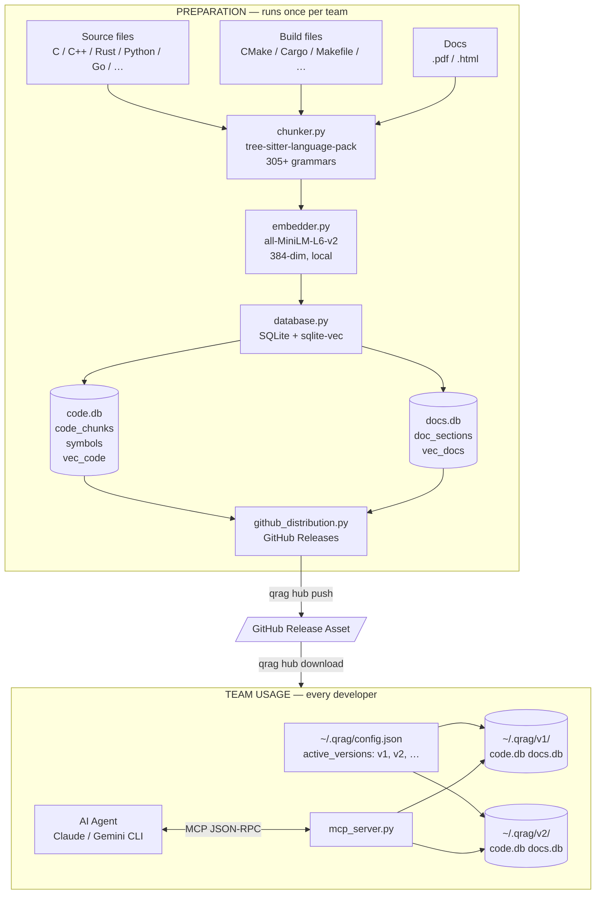
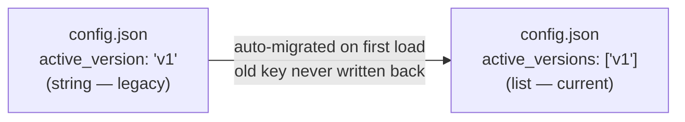
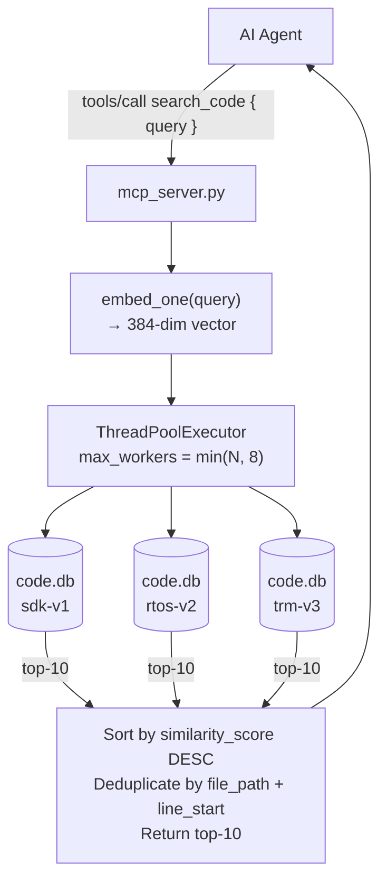
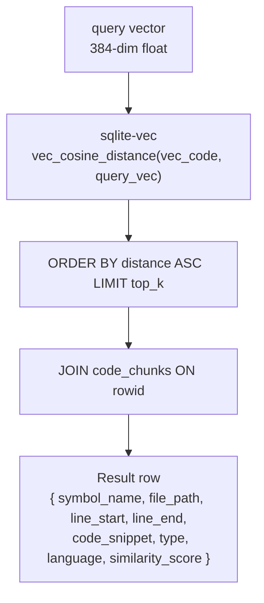
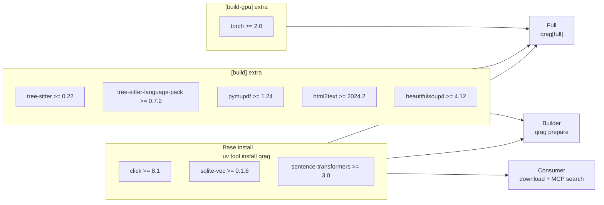
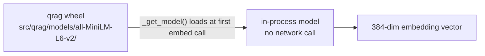
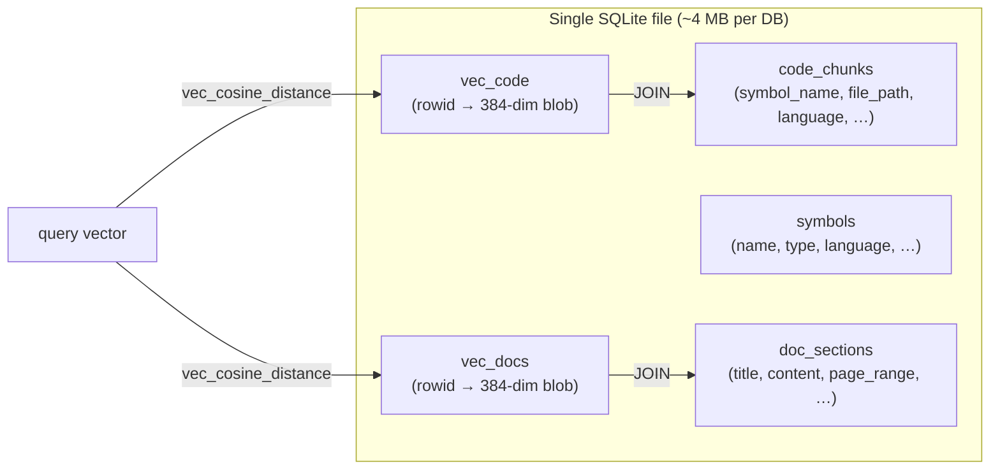
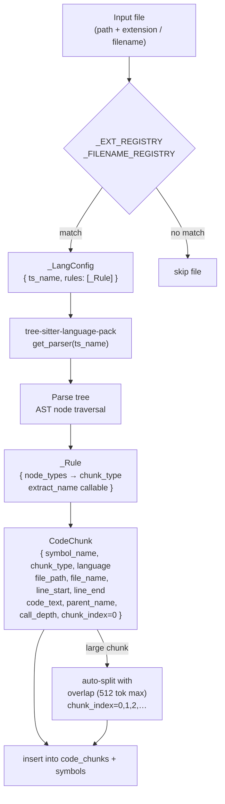
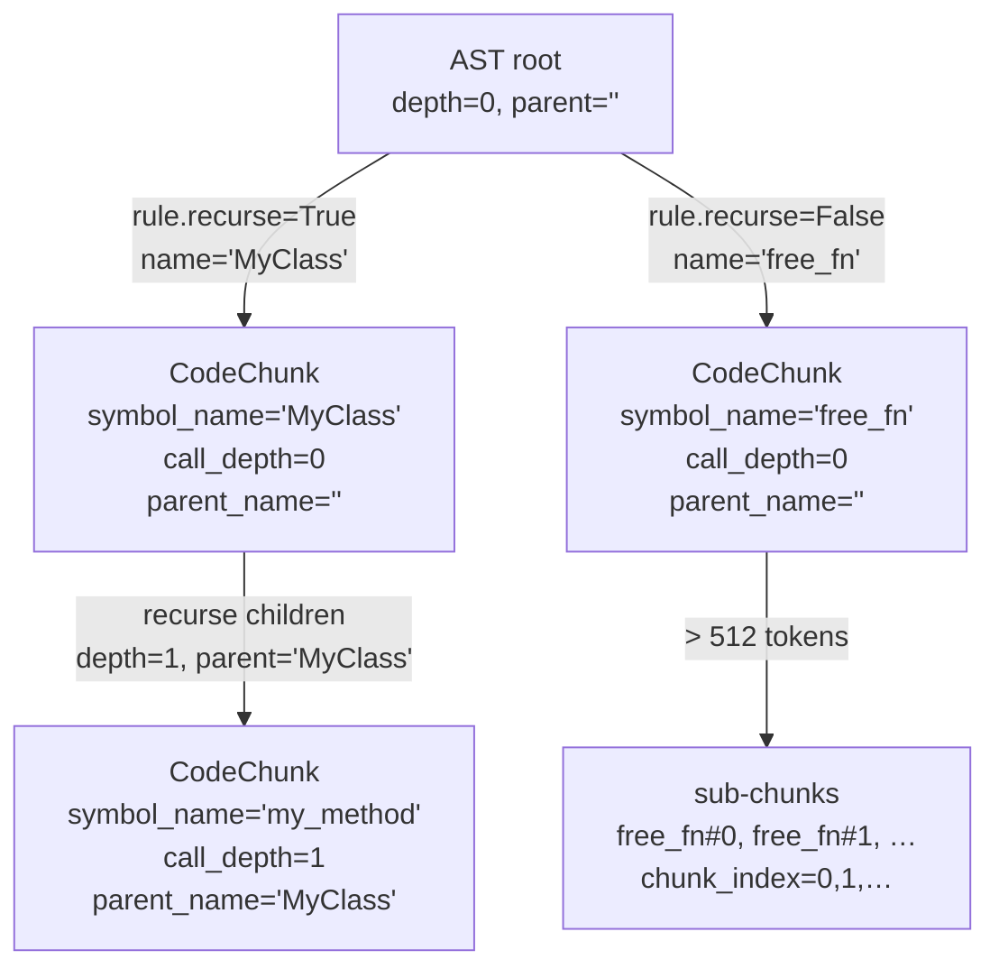
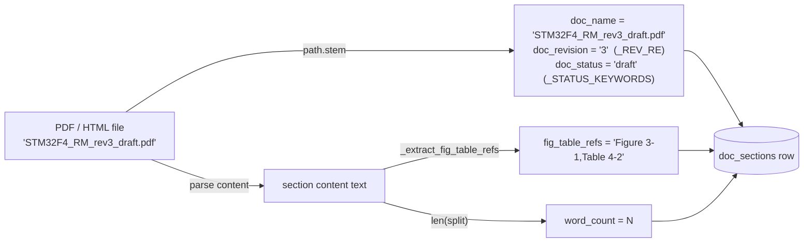

# qrag — Architecture & Design Decisions

This file documents the key architectural decisions in qrag with Mermaid diagrams.
Update it whenever a design decision is made or changed. Use Mermaid syntax for all diagrams.

---

## System Overview



---

## AD-1: Multi-DB Fan-Out Search (IS3)

**Decision:** Users can activate multiple independently-prepared databases at once.
All four MCP tools fan-out across every active DB in parallel, merge results by
score, and deduplicate before returning to the AI agent.

**Why:** Teams work with multiple SDKs, RTOSes, and doc sets simultaneously.
Requiring a merged re-prepare for each new source is prohibitive. Pre-built DBs
downloaded independently must be queryable together without rebuilding.

### Config Migration



### Fan-Out Flow



### Per-DB Search (inside database.py)



### Complexity

| Scenario | Wall-clock cost |
|----------|----------------|
| 1 DB | 1× single-DB search latency |
| N DBs (N ≤ 8) | ≈ 1× single-DB search latency (fully parallel) |
| N DBs (N > 8) | ≈ ⌈N/8⌉ × single-DB search latency |

sqlite-vec cosine search is **O(rows)** per DB. At ~4 MB per DB (~10k chunks),
a single search completes in <50 ms on CPU. 100 DBs with 8 workers = ~13 rounds
≈ 650 ms worst case — acceptable for an AI-agent tool call.

### CLI Usage

```
# Set one active version
qrag ai active sdk-v1

# Set multiple active versions (replaces the list)
qrag ai active sdk-v1 rtos-v2 trm-v3

# Show current active versions
qrag ai active

# prepare and hub download auto-add to the list
qrag prepare -i /path/to/code -o sdk-v1      # → active_versions gains "sdk-v1"
qrag hub download rtos-v2                    # → active_versions gains "rtos-v2"
```

---

## AD-2: Dependency Split — Consumer vs Builder (GH#13)

**Decision:** Builder dependencies (parsing, grammar, doc parsing) are optional
extras. The consumer install only needs `click + sqlite-vec + sentence-transformers`.

**Why:** `sentence-transformers` pulls in `torch` and GPU deps. `tree-sitter-language-pack`
is large. Teams that only download and query pre-built DBs shouldn't pay that cost.



**Guard in `prepare()`:** `_ensure_build_deps()` probes `tree_sitter`, `fitz`,
`tree_sitter_language_pack` → prints reinstall instructions and exits 1 if missing.

---

## AD-3: Embedding Model — Bundled Local (all-MiniLM-L6-v2)

**Decision:** `all-MiniLM-L6-v2` (384-dim) is bundled inside the wheel under
`src/qrag/models/`. No HuggingFace call at runtime.

**Why:** Air-gapped embedded-systems environments cannot reach HuggingFace.
Startup time must be deterministic. The model is small (≈22 MB).

**Trade-off:** Wheel is larger. Model version is pinned and must be explicitly
updated. A future model upgrade requires a new wheel release.



---

## AD-4: SQLite + sqlite-vec (no external vector DB)

**Decision:** All storage is a single SQLite file with sqlite-vec for vector
search. No Chroma, Pinecone, or other external service.

**Why:** Pre-built DBs are distributed as GitHub Release assets and downloaded
by the team. A single-file format requires zero server infra, works offline,
and is trivially versioned via GitHub Releases.

**Trade-off:** sqlite-vec cosine search is O(n) — no ANN index. At current
scale (~10k chunks per DB) this is fast enough. If a single DB exceeds ~1M
chunks, an ANN index (e.g. FAISS) would be needed.



---

## AD-5: Multi-Language Parsing — Registry-Driven (C0)

**Decision:** `chunker.py` uses `tree-sitter-language-pack` (305+ grammars)
with a registry-driven rule engine. `chunk_type` is a free-form string, not an enum.

**Why:** Individual `tree-sitter-c/cpp` packages don't scale to 30+ languages.
Free-form `chunk_type` means new language support never requires a DB schema
migration — just a new registry entry.



---

## AD-6: Rich Code Metadata — IS5

**Decision:** `code_chunks` gains four new columns: `file_name` (basename), `parent_name`
(enclosing block), `call_depth` (nesting level), `chunk_index` (sub-chunk index within
a split symbol). Existing DBs are auto-migrated via `ALTER TABLE` on open.

**Why:** The AI agent needs precise citation (file + line range), structural context
(what class/namespace owns this function), and sub-chunk tracking (which slice of a
large function it is looking at) to answer questions accurately.



**Schema migration:** `_open_code()` runs `ALTER TABLE code_chunks ADD COLUMN …` for
each new column on every open; `sqlite3.OperationalError` is swallowed when the column
already exists. `init_code_db` includes all columns in `CREATE TABLE IF NOT EXISTS`.

---

## AD-7: Rich Doc Metadata — IS4

**Decision:** `doc_sections` gains five new columns: `doc_name`, `doc_revision`,
`doc_status`, `word_count`, `fig_table_refs`. Extracted at parse time from the filename
and section content. Existing DBs are auto-migrated on open via `_open_docs()`.

**Why:** LLMs need to cite documents precisely (which document, which revision, which
status). Figure/table references let the agent locate companion material. Word count
helps the agent judge whether content has been truncated.



**Revision extraction:** `_REV_RE = r'[_\\-\\s](?:rev?|ver?|version)\\.?\\s*(\\d+[.\\d]*)'`
matches `_rev3`, `_v2`, `_Rev1.2` etc. from the filename stem.

**Status extraction:** first match of `released | approved | final | review | draft | obsolete`
in the lowercased filename stem. Empty string if none matched.
